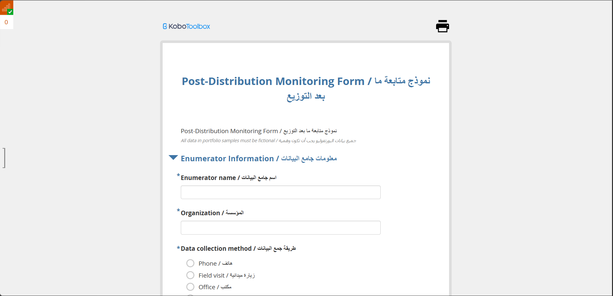
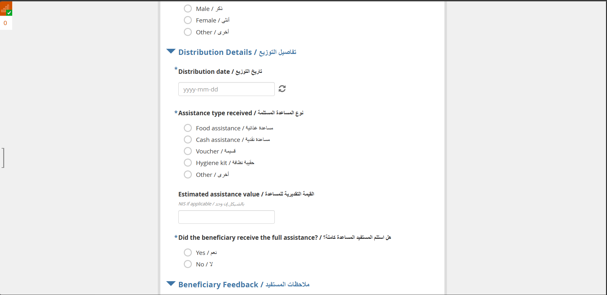

# Post-Distribution Monitoring Form

## Overview

This project contains a KoboToolbox post-distribution monitoring form designed to capture beneficiary follow-up data after the delivery of assistance. The form uses a bilingual Arabic and English layout to support clear field data collection and reporting.

## Project Goal

The form is intended to help organizations assess whether distributed assistance reached beneficiaries as planned, document delivery details, and capture beneficiary feedback after the distribution process.

## Form Highlights

- Bilingual Arabic and English interface
- Enumerator and organization information section
- Data collection method tracking
- Beneficiary profile details
- Distribution date and assistance type capture
- Estimated assistance value field
- Verification of full assistance receipt
- Beneficiary feedback and follow-up structure
- Suitable for post-distribution monitoring workflows

## Included Files

- [XLSForm Source](./04_post_distribution_monitoring_xlsform.xlsx)
- [Screenshot 1](./screenshots/01-form-header.png)
- [Screenshot 2](./screenshots/02-distribution-details-section.png)

## Kobo Link

- Live Form: [https://ee.kobotoolbox.org/x/2bayq1cw](https://ee.kobotoolbox.org/x/2bayq1cw)

## Screenshots

### Form Header and Enumerator Information

### Distribution Details Section

## Notes

- This form is useful for monitoring assistance delivery quality and beneficiary experience after distribution.
- The bilingual structure supports teams working in Arabic-speaking field environments while preserving clear English documentation.
