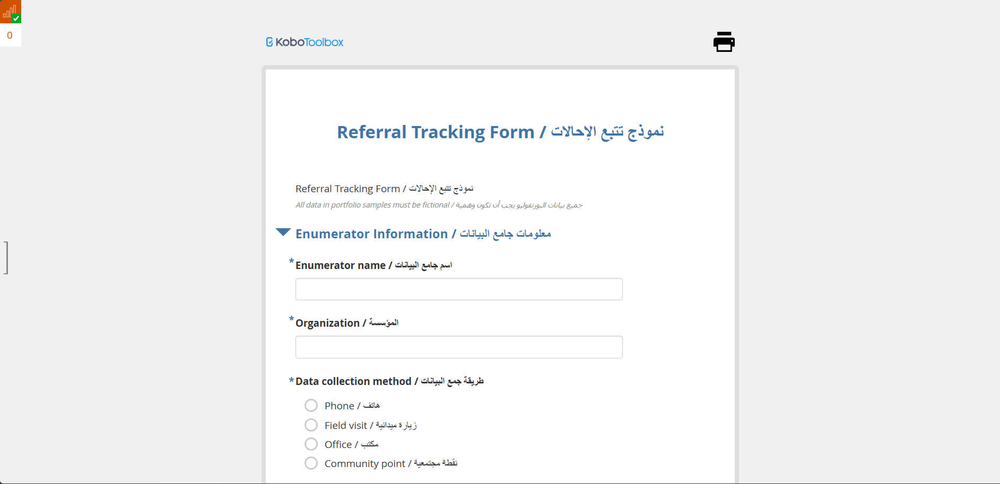
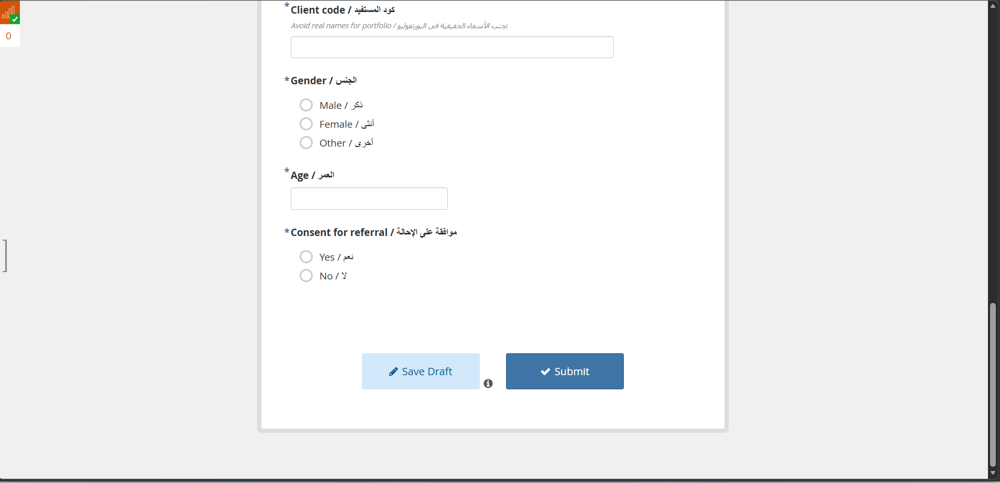

# Referral Tracking Form

## Overview

This project contains a KoboToolbox referral tracking form designed to document client referrals in a structured bilingual Arabic and English workflow. The form supports safe documentation of beneficiary information, referral consent, and follow-up details in a portfolio-friendly format.

## Project Goal

The form is intended to help organizations record referrals consistently, track essential beneficiary details, and confirm whether the client has agreed to the referral process.

## Form Highlights

- Bilingual Arabic and English interface
- Enumerator and organization information section
- Data collection method tracking
- Client code and demographic capture
- Gender and age documentation
- Consent-for-referral confirmation
- Structured referral intake workflow
- Suitable for case management and service coordination contexts

## Included Files

- [XLSForm Source](./06_referral_tracking_xlsform.xlsx)
- [Screenshot 1](./screenshots/01-form-header.png)
- [Screenshot 2](./screenshots/02-client-consent-section.png)

## Kobo Link

- Live Form: [https://ee.kobotoolbox.org/x/L64Rv3Vq](https://ee.kobotoolbox.org/x/L64Rv3Vq)

## Screenshots

### Form Header and Enumerator Information

### Client Information and Consent Section

## Notes

- This form is useful for documenting referral cases in a consistent and traceable way.
- The bilingual structure supports field teams that need both Arabic usability and English documentation.
