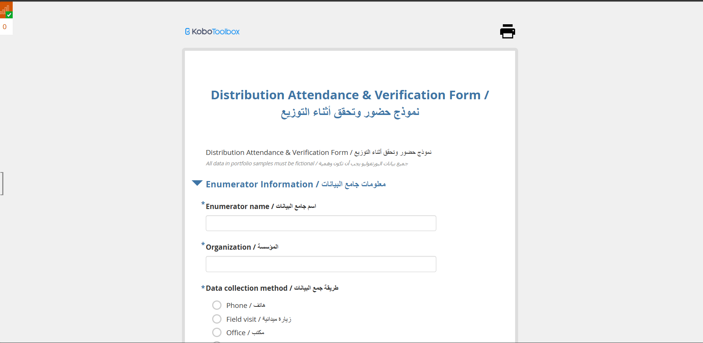
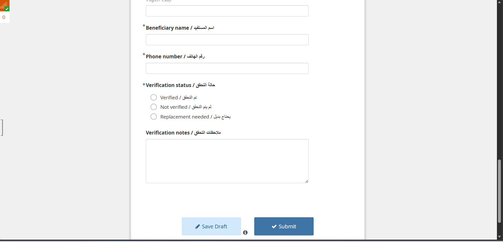

# Distribution Attendance & Verification Form

## Overview

This project contains a KoboToolbox distribution attendance and verification form designed to confirm beneficiary presence and verify distribution records during assistance delivery. The form uses a bilingual Arabic and English structure to support clear field verification workflows.

## Project Goal

The form is intended to help organizations record attendance during distribution events, verify beneficiary information, and document whether verification was successful or if follow-up or replacement is needed.

## Form Highlights

- Bilingual Arabic and English interface
- Enumerator and organization information section
- Data collection method tracking
- Beneficiary identification and contact fields
- Verification status options
- Verification notes section
- Suitable for on-site distribution attendance and verification workflows

## Included Files

- [XLSForm Source](./05_distribution_verification_xlsform.xlsx)
- [Screenshot 1](./screenshots/01-form-header.png)
- [Screenshot 2](./screenshots/02-verification-status-section.png)

## Kobo Link

- Live Form: [https://ee.kobotoolbox.org/x/v8zAnydT](https://ee.kobotoolbox.org/x/v8zAnydT)

## Screenshots

### Form Header and Enumerator Information

### Beneficiary Verification Section

## Notes

- This form is useful for tracking attendance and verifying whether the correct beneficiary received or was eligible to receive assistance.
- The structure supports quick field checks while preserving clear documentation for follow-up cases.
