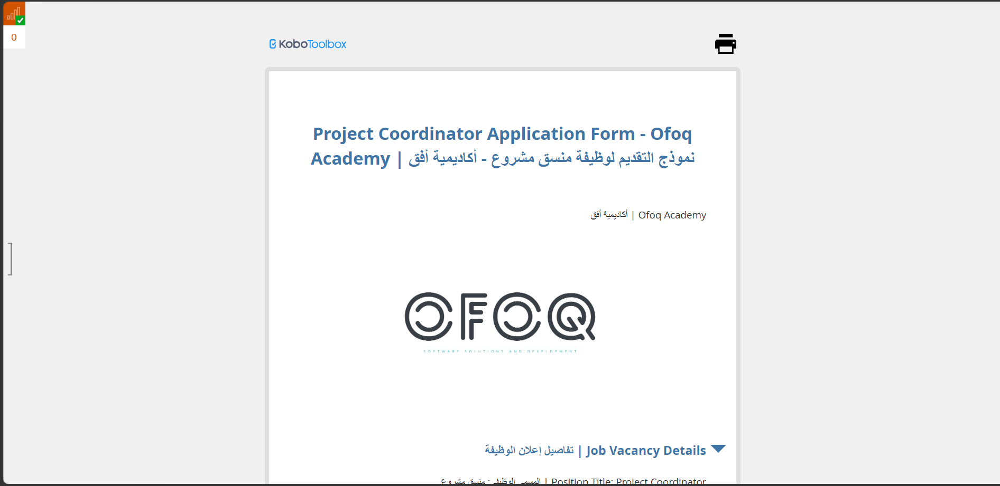
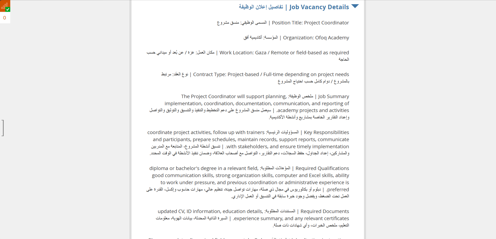
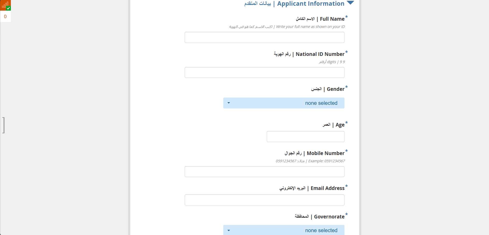
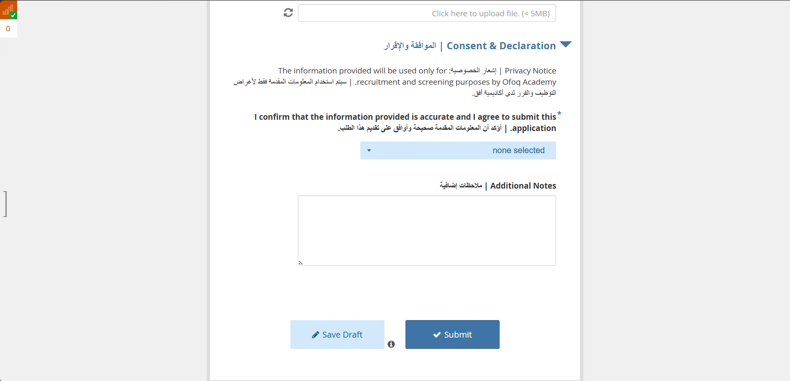

# Project Coordinator Application Form - Ofoq Academy

## Overview

This project contains a KoboToolbox job application form prepared for Ofoq Academy to collect applications for a Project Coordinator position. The form uses a bilingual Arabic and English structure and includes vacancy details, applicant information, file upload, and consent sections.

## Project Goal

The form is intended to streamline recruitment data collection for a project coordinator role by presenting vacancy information clearly and collecting structured applicant details in a professional digital workflow.

## Form Highlights

- Bilingual Arabic and English interface
- Branded job application cover section
- Job vacancy details and position summary
- Applicant personal and contact information
- Governorate and demographic fields
- Document upload support
- Consent, declaration, and additional notes section
- Suitable for recruitment and application intake workflows

## Included Files

- [XLSForm Source](./ofoq_project_coordinator_application_xlsform.xlsx)
- [Screenshot 1](./screenshots/01-form-cover.png)
- [Screenshot 2](./screenshots/02-job-vacancy-details.png)
- [Screenshot 3](./screenshots/03-applicant-information.png)
- [Screenshot 4](./screenshots/04-consent-and-declaration.png)

## Kobo Link

- Live Form: [https://ee.kobotoolbox.org/x/zPXGzpxd](https://ee.kobotoolbox.org/x/zPXGzpxd)

## Screenshots

### Form Cover and Branding

### Job Vacancy Details Section

### Applicant Information Section

### Consent and Declaration Section

## Notes

- This form is suitable for recruitment workflows where organizations need structured and bilingual applicant data collection.
- The layout combines vacancy information with application intake in a single user-friendly Kobo form.
